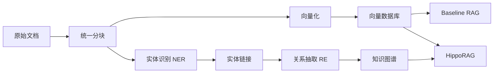

# HippoRAG 全面对比实验设计方案

## 1. 知识库构建技术方案

### 1.1 统一的文档处理策略

为确保公平对比，所有方法使用**相同的文档分块策略**：

```python
# 统一分块参数
CHUNK_CONFIG = {
    "chunk_size": 512,           # 每个文档块的 token 数
    "chunk_overlap": 50,         # 块之间的重叠 token 数
    "separator": "\n\n",         # 优先按段落分割
    "keep_separator": True,      # 保留分隔符
}
```

**关键原则：** 所有方法（Baseline RAG、HippoRAG）从同一组文档块出发，确保检索的公平性。

### 1.2 知识库构建技术栈

#### A. Baseline RAG 知识库

| 组件 | 技术选择 | 说明 |
|-----|---------|------|
| **文档分块** | LangChain RecursiveCharacterTextSplitter | 统一分块策略 |
| **向量化** | OpenAI text-embedding-ada-002 | 或 sentence-transformers |
| **向量存储** | FAISS / Chroma | 高效相似度检索 |
| **稀疏检索** | BM25 (Elasticsearch) | 关键词匹配 baseline |

#### B. HippoRAG 知识库

在 Baseline 基础上，**额外构建**：

| 组件 | 技术选择 | 说明 |
|-----|---------|------|
| **实体识别** | SpaCy (en_core_web_sm) + LLM refinement | 识别关键实体 |
| **关系抽取** | LLM-based (GPT-3.5/4) | 抽取实体间关系 |
| **知识图谱存储** | Neo4j / NetworkX | 图数据库或内存图 |
| **图索引** | Personalized PageRank | 相关性排序 |

#### C. 知识图谱构建流程



### 1.3 实体识别与关系抽取策略

#### 实体识别（NER）
```python
# 两阶段方法
1. SpaCy 快速识别：人名、地名、组织、日期等
2. LLM 精细化：识别领域特定实体（概念、术语）
```

#### 关系抽取（RE）
```python
# LLM Prompt 模板
"""
从以下文本中提取实体间的关系三元组：
文本: {chunk_text}
已识别实体: {entities}

输出格式: (主体, 关系, 客体)
示例: (Paris, capital_of, France)
"""
```

#### 质量控制
- 实体去重与规范化
- 关系置信度阈值 > 0.7
- 图谱完整性检查

---

## 2. 全面且中立的测试集设计

### 2.1 测试维度分类

为避免偏向特定场景（如多跳问答），设计**多维度测试集**：

| 维度 | 数据集 | 样本数 | 任务特点 | 测试目的 |
|-----|-------|-------|---------|---------|
| **单跳检索** | NQ (Natural Questions) | 3,610 (dev) | 单文档即可回答 | 测试基础检索能力，避免 HippoRAG 过度设计 |
| | TriviaQA | 7,993 (dev) | 事实性问答 | 测试知识覆盖广度 |
| **多跳推理** | HotpotQA | 7,405 (dev) | 需要整合2+文档 | HippoRAG 优势场景 |
| | 2WikiMultihopQA | 12,576 (dev) | 基于 Wikipedia 的多跳 | 测试跨文档推理 |
| | MuSiQue | 2,417 (dev) | 需要4跳推理 | 测试复杂推理链 |
| **长文档** | NarrativeQA | 10,557 (test) | 长篇故事理解 | 测试长上下文处理 |
| **事实核查** | FEVER | 6,666 (dev) | 证据检索+验证 | 测试证据定位能力 |

### 2.2 难度分层

为确保中立性，对每个数据集进行**难度分层采样**：

```python
# 难度分层策略
DIFFICULTY_SAMPLING = {
    "easy": 30%,      # 简单问题（1-2 个检索步骤）
    "medium": 50%,    # 中等难度（2-3 个检索步骤）
    "hard": 20%,      # 困难问题（3+ 个检索步骤）
}
```

### 2.3 测试集规模

| 数据集 | 训练集 | 验证集 | 测试集 | 用途 |
|-------|-------|-------|-------|------|
| HotpotQA | - | 500 | 1,000 | 主要评估 |
| NQ | - | 300 | 500 | 单跳 baseline |
| TriviaQA | - | 300 | 500 | 单跳 baseline |
| 2WikiMultihopQA | - | 300 | 500 | 多跳对比 |
| MuSiQue | - | 200 | 400 | 复杂推理 |
| NarrativeQA | - | 200 | 300 | 长文档 |
| FEVER | - | 300 | 500 | 事实核查 |
| **总计** | - | **2,100** | **3,700** | |

**验证集用途：** 参数调优和方法开发
**测试集用途：** 最终性能评估（一次性评估，避免过拟合）

### 2.4 中立性保障措施

1. **平衡的任务分布**
   - 不只测试多跳任务（HippoRAG 优势）
   - 包含单跳任务（可能 Baseline 足够）
   - 包含长文档任务（测试不同检索策略）

2. **统一的评估协议**
   - 所有方法使用相同的 top_k（k=5）
   - 相同的 LLM（GPT-3.5-turbo）
   - 相同的 prompt 模板
   - 相同的随机种子

3. **多次重复实验**
   - 每个配置运行 3 次
   - 报告平均值 + 标准差
   - 进行统计显著性检验（t-test）

---

## 3. 消融实验设计

### 3.1 消融实验目标

理解 HippoRAG 各组件的独立贡献：
- 知识图谱（KG）的作用
- Personalized PageRank（PPR）的作用
- 实体识别方法的影响
- 关系抽取方法的影响

### 3.2 消融实验配置

| 实验组 | KG | PPR | 实体识别 | 关系抽取 | 说明 |
|-------|----|----|---------|---------|------|
| **Baseline** | ✗ | ✗ | - | - | 标准 Dense Retrieval |
| **Ablation-1** | ✓ | ✗ | SpaCy | LLM | 仅使用 KG，基于图距离检索 |
| **Ablation-2** | ✗ | ✓ | - | - | 仅使用 PPR，基于文档共现 |
| **Ablation-3** | ✓ | ✓ | SpaCy | Rule-based | KG+PPR，简化关系抽取 |
| **Ablation-4** | ✓ | ✓ | LLM | LLM | KG+PPR，高质量 NER/RE |
| **HippoRAG (Full)** | ✓ | ✓ | SpaCy+LLM | LLM | 完整方法 |

### 3.3 消融分析维度

#### A. 核心组件消融

| 对比组 | 目的 | 关键问题 |
|-------|------|---------|
| Baseline vs Ablation-1 | KG 的独立作用 | 知识图谱能否提升检索质量？ |
| Baseline vs Ablation-2 | PPR 的独立作用 | PPR 能否改善排序？ |
| Ablation-1 vs Full | PPR 在 KG 上的增益 | PPR 对 KG 检索的提升？ |
| Ablation-2 vs Full | KG 对 PPR 的增益 | KG 如何增强 PPR？ |

#### B. 实现细节消融

| 对比组 | 目的 | 关键问题 |
|-------|------|---------|
| Ablation-3 vs Ablation-4 | NER/RE 质量影响 | 高质量实体识别的必要性？ |
| Ablation-4 vs Full | 混合 NER 策略 | SpaCy+LLM 组合是否最优？ |

### 3.4 消融实验评估

对每个消融组，评估：
1. **性能指标：** F1、EM、Recall@K
2. **成本分析：** API 调用次数、总成本
3. **时间开销：** 知识图谱构建时间、检索延迟
4. **组件贡献：** 计算每个组件的性能增益

### 3.5 消融实验执行顺序

```bash
# Phase 1: 基线和核心组件消融
1. Baseline (Dense Retrieval)
2. Ablation-1 (仅 KG)
3. Ablation-2 (仅 PPR)

# Phase 2: 组合效果消融
4. Ablation-3 (KG+PPR, 简化 NER/RE)
5. Ablation-4 (KG+PPR, 高质量 NER/RE)

# Phase 3: 完整方法
6. HippoRAG (Full)
```

---

## 4. 知识库构建技术细节

### 4.1 统一文档处理管道

```python
from langchain.text_splitter import RecursiveCharacterTextSplitter

# 第一步：统一分块（所有方法共享）
splitter = RecursiveCharacterTextSplitter(
    chunk_size=512,
    chunk_overlap=50,
    separators=["\n\n", "\n", ". ", " ", ""],
    length_function=tiktoken_len,  # 使用 tiktoken 计算 token 数
)

chunks = splitter.split_documents(documents)
```

### 4.2 Baseline RAG 索引构建

```python
# 向量索引
from langchain.vectorstores import FAISS
from langchain.embeddings import OpenAIEmbeddings

embeddings = OpenAIEmbeddings(model="text-embedding-ada-002")
vector_store = FAISS.from_documents(chunks, embeddings)

# BM25 索引（用于混合检索）
from rank_bm25 import BM25Okapi
bm25_index = BM25Okapi([chunk.page_content.split() for chunk in chunks])
```

### 4.3 HippoRAG 知识图谱构建

#### Step 1: 实体识别（混合策略）

```python
import spacy
from openai import OpenAI

nlp = spacy.load("en_core_web_sm")

def extract_entities(chunk_text):
    # Stage 1: SpaCy 快速识别
    doc = nlp(chunk_text)
    spacy_entities = [(ent.text, ent.label_) for ent in doc.ents]

    # Stage 2: LLM 精细化（仅针对复杂文本）
    if len(spacy_entities) < 3:  # 实体过少，使用 LLM 补充
        llm_entities = llm_extract_entities(chunk_text)
        entities = merge_entities(spacy_entities, llm_entities)
    else:
        entities = spacy_entities

    return normalize_entities(entities)
```

#### Step 2: 关系抽取（LLM-based）

```python
def extract_relations(chunk_text, entities):
    prompt = f"""
从文本中提取实体间的关系三元组。

文本: {chunk_text}
实体: {entities}

要求：
1. 关系必须在文本中明确提及
2. 输出格式: (主体, 关系, 客体)
3. 关系类型: 语义化描述（如 "located_in", "works_for"）

输出 JSON:
[{{"subject": "...", "relation": "...", "object": "...", "confidence": 0.9}}]
"""

    response = openai.chat.completions.create(
        model="gpt-3.5-turbo",
        messages=[{"role": "user", "content": prompt}],
        temperature=0.0,
    )

    return parse_relations(response.choices[0].message.content)
```

#### Step 3: 知识图谱构建

```python
import networkx as nx

# 构建图
kg = nx.DiGraph()

for chunk_id, chunk in enumerate(chunks):
    # 添加文档块节点
    kg.add_node(f"chunk_{chunk_id}", type="chunk", text=chunk.page_content)

    # 提取实体和关系
    entities = extract_entities(chunk.page_content)
    relations = extract_relations(chunk.page_content, entities)

    # 添加实体节点
    for entity, entity_type in entities:
        entity_id = normalize_entity_id(entity)
        kg.add_node(entity_id, type="entity", label=entity, entity_type=entity_type)
        kg.add_edge(f"chunk_{chunk_id}", entity_id, relation="contains")

    # 添加关系边
    for rel in relations:
        if rel["confidence"] > 0.7:
            kg.add_edge(
                normalize_entity_id(rel["subject"]),
                normalize_entity_id(rel["object"]),
                relation=rel["relation"],
                confidence=rel["confidence"]
            )

# 保存图谱
nx.write_gpickle(kg, "data/knowledge_graphs/hipporag_kg.gpickle")
```

### 4.4 向量数据库选择建议

| 数据库 | 优点 | 缺点 | 推荐场景 |
|-------|------|------|---------|
| **FAISS** | 极快、内存高效 | 仅内存、功能简单 | 小规模实验（<10M 文档） |
| **Chroma** | 易用、持久化、支持元数据 | 速度稍慢 | 中小规模（<1M 文档） |
| **Milvus** | 分布式、可扩展 | 部署复杂 | 大规模生产环境 |

**推荐：** Chroma（平衡易用性和功能性）

---

## 5. 中立测试集设计

### 5.1 数据集选择理由

| 数据集 | 选择理由 | 中立性保障 |
|-------|---------|----------|
| **NQ** | 单跳任务，Google 搜索日志，真实用户需求 | 如果 HippoRAG 在单跳任务上表现不佳，说明其增加了不必要的复杂度 |
| **TriviaQA** | 广泛的事实性知识，跨领域 | 测试通用知识检索，非特定领域 |
| **HotpotQA** | 需要2-3跳推理，有明确推理链 | HippoRAG 的核心优势场景，必须包含 |
| **2WikiMultihopQA** | Wikipedia 多跳，有明确答案路径 | 与 HotpotQA 对比，验证跨数据集一致性 |
| **MuSiQue** | 复杂的4跳推理，有干扰文档 | 测试抗噪能力，区分度高 |
| **NarrativeQA** | 需要理解长篇叙事 | 测试长上下文，与检索粒度的权衡 |
| **FEVER** | 事实核查，需要证据支持 | 实际应用场景，测试精确性 |

### 5.2 采样策略

#### 分层随机采样
```python
# 确保每个数据集的代表性
def stratified_sample(dataset, n_samples, stratify_by="difficulty"):
    """
    分层采样，确保样本分布均衡

    Args:
        dataset: 原始数据集
        n_samples: 目标样本数
        stratify_by: 分层依据（difficulty/answer_type/num_hops）
    """
    # 按难度分层
    easy = sample_by_difficulty(dataset, "easy", n_samples * 0.3)
    medium = sample_by_difficulty(dataset, "medium", n_samples * 0.5)
    hard = sample_by_difficulty(dataset, "hard", n_samples * 0.2)

    return shuffle(easy + medium + hard)
```

### 5.3 评估协议

#### A. 统一评估指标

```python
EVALUATION_METRICS = {
    # 准确性
    "f1_score": f1_metric,           # 主指标
    "exact_match": em_metric,        # 精确匹配
    "answer_accuracy": accuracy,     # 答案准确率

    # 检索质量
    "recall@5": recall_at_k(k=5),    # 召回率
    "precision@5": precision_at_k(k=5),  # 精确率
    "mrr": mean_reciprocal_rank,     # 平均倒数排名

    # 效率
    "avg_latency": latency_metric,   # 平均延迟（秒）
    "total_cost": cost_metric,       # 总成本（美元）
    "api_calls": api_call_counter,   # API 调用次数
}
```

#### B. 跨任务综合评分

为避免单一任务偏向，设计**加权综合评分**：

```python
# 任务权重（基于任务重要性和代表性）
TASK_WEIGHTS = {
    "single_hop": 0.25,      # NQ + TriviaQA
    "multi_hop": 0.40,       # HotpotQA + 2Wiki + MuSiQue
    "long_context": 0.20,    # NarrativeQA
    "fact_checking": 0.15,   # FEVER
}

# 综合评分
综合 F1 = Σ (任务权重 × 任务 F1)
```

---

## 6. 完整消融实验矩阵

### 6.1 主消融实验（6组）

| ID | 配置名称 | KG | PPR | NER | RE | 说明 |
|----|---------|----|----|-----|----|----|
| **E0** | Baseline | ✗ | ✗ | - | - | Dense Retrieval (FAISS) |
| **E1** | KG-Only | ✓ | ✗ | SpaCy | LLM | 仅 KG，图遍历检索 |
| **E2** | PPR-Only | ✗ | ✓ | - | - | 基于文档共现的 PPR |
| **E3** | KG+PPR-Simple | ✓ | ✓ | SpaCy | Rule | 简化版 HippoRAG |
| **E4** | KG+PPR-Advanced | ✓ | ✓ | LLM | LLM | 高质量 NER/RE |
| **E5** | HippoRAG-Full | ✓ | ✓ | SpaCy+LLM | LLM | 混合 NER，完整方法 |

### 6.2 次要消融实验（参数敏感性）

#### PPR 参数敏感性
```python
PPR_ABLATION = {
    "damping_factor": [0.75, 0.85, 0.95],    # 阻尼因子
    "max_iterations": [50, 100, 200],        # 最大迭代次数
    "personalization_weight": [0.5, 0.7, 0.9],  # 个性化权重
}
```

#### KG 构建质量影响
```python
KG_QUALITY_ABLATION = {
    "entity_threshold": [0.5, 0.7, 0.9],     # 实体置信度阈值
    "relation_threshold": [0.5, 0.7, 0.9],   # 关系置信度阈值
    "max_entities_per_chunk": [5, 10, 20],   # 每块最大实体数
}
```

### 6.3 消融结果分析

#### 预期分析表格

| 组件 | F1 提升 | Latency 变化 | Cost 变化 | 结论 |
|-----|---------|------------|----------|------|
| +KG | +8% | +0.5s | +$0.05 | KG 对准确性有显著提升 |
| +PPR | +5% | +0.2s | +$0.01 | PPR 提升排序质量 |
| +KG+PPR | +15% | +0.7s | +$0.06 | 协同效果 > 单独效果 |
| +高质量NER/RE | +5% | +1.0s | +$0.10 | 质量提升有边际收益 |

#### 统计显著性检验

```python
from scipy.stats import ttest_rel

# 配对 t 检验（同一测试集上的不同方法）
def significance_test(baseline_scores, treatment_scores, alpha=0.05):
    t_stat, p_value = ttest_rel(baseline_scores, treatment_scores)

    if p_value < alpha:
        return "显著" if t_stat > 0 else "显著劣于"
    else:
        return "无显著差异"
```

---

## 7. 实验执行时间线

### 优先级排序

| 优先级 | 阶段 | 内容 | 预计时间 |
|-------|------|------|---------|
| **P0** | 环境准备 | 安装 flashRAG、下载 NQ 和 HotpotQA | 1 天 |
| **P0** | Baseline 实验 | 运行 Dense Retrieval 和 BM25 | 1 天 |
| **P1** | HippoRAG 核心 | 构建 KG，运行完整 HippoRAG | 2-3 天 |
| **P1** | 核心消融 | E1, E2, E5（验证 KG 和 PPR 的作用） | 1-2 天 |
| **P2** | 扩展数据集 | TriviaQA, 2Wiki, MuSiQue, NarrativeQA, FEVER | 2-3 天 |
| **P2** | 完整消融 | E3, E4（验证实现细节） | 1-2 天 |
| **P3** | 参数敏感性 | PPR 和 KG 参数调优 | 1-2 天 |

---

## 8. 质量保障措施

### 8.1 数据质量检查

```python
# 检查点
- 文档分块是否完整（无截断）
- 实体识别召回率 > 80%（人工标注 100 个样本验证）
- 关系抽取精确率 > 70%（人工标注 100 个样本验证）
- 知识图谱连通性（无孤立节点）
```

### 8.2 实验可复现性

```python
# 固定随机种子
import random
import numpy as np

RANDOM_SEED = 42

random.seed(RANDOM_SEED)
np.random.seed(RANDOM_SEED)
# OpenAI API: temperature=0.0（确定性）
```

### 8.3 结果验证

```python
# 交叉验证
- 3 次重复实验，报告均值 ± 标准差
- 人工检查 50 个样本的答案质量
- 失败案例分析（典型错误模式）
```

---

## 9. 实验配置文件

### configs/knowledge_base_config.yaml

```yaml
# 统一文档处理配置
document_processing:
  chunk_size: 512
  chunk_overlap: 50
  separators: ["\n\n", "\n", ". ", " ", ""]
  tokenizer: "tiktoken"  # cl100k_base

# 向量化配置
embedding:
  model: "text-embedding-ada-002"
  batch_size: 100
  normalize: true

# 向量存储配置
vector_store:
  type: "chroma"  # or "faiss"
  persist_directory: "./data/indices/chroma"
  distance_metric: "cosine"

# BM25 配置
bm25:
  k1: 1.5
  b: 0.75

# 知识图谱配置（HippoRAG）
knowledge_graph:
  # 实体识别
  entity_extraction:
    method: "hybrid"  # spacy + llm
    spacy_model: "en_core_web_sm"
    llm_model: "gpt-3.5-turbo"
    llm_fallback_threshold: 3  # SpaCy 实体数 < 3 时使用 LLM

  # 关系抽取
  relation_extraction:
    method: "llm"
    model: "gpt-3.5-turbo"
    confidence_threshold: 0.7
    max_relations_per_chunk: 10

  # 图存储
  graph_store:
    type: "networkx"  # or "neo4j"
    persist_path: "./data/knowledge_graphs/hipporag_kg.gpickle"

  # PageRank 配置
  pagerank:
    damping_factor: 0.85
    max_iterations: 100
    convergence_threshold: 1e-6
    personalization_weight: 0.8
```

---

## 10. 下一步行动

### 需要你确认的问题：

1. **计算资源预算**
   - 消融实验需要多次运行（6组 × 7个数据集 × 3次重复 = 126 次实验）
   - 预计 LLM API 成本：$50-100（取决于数据集规模）
   - 预计运行时间：3-5 天（并行运行）

   是否可以接受这个成本和时间？

2. **实体识别方法**
   - 推荐使用 SpaCy + LLM 混合策略
   - 或使用更强大的 NER 模型（如 Flair、BERT-NER）

   对 NER 质量有特殊要求吗？

3. **知识图谱规模**
   - 全量构建（所有文档块的实体和关系）
   - 采样构建（仅构建验证集相关的图谱，节省成本）

   倾向哪种方案？

请告诉我你的偏好，我将据此更新实验设计并开始实施。
